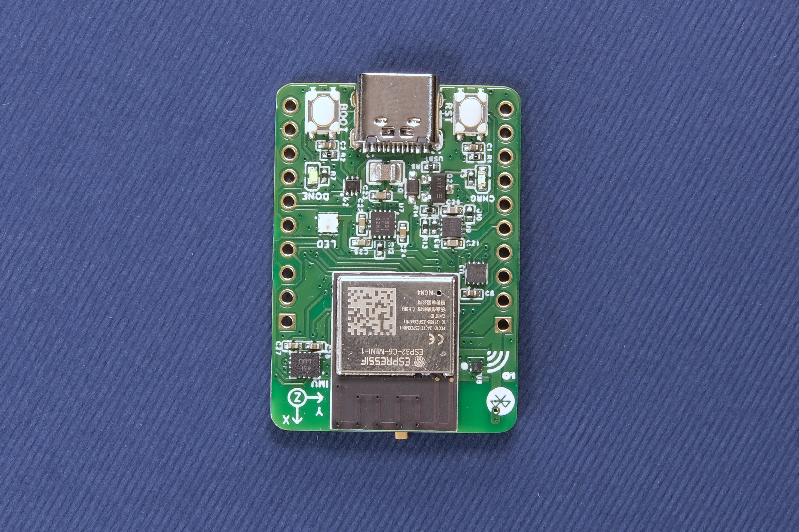
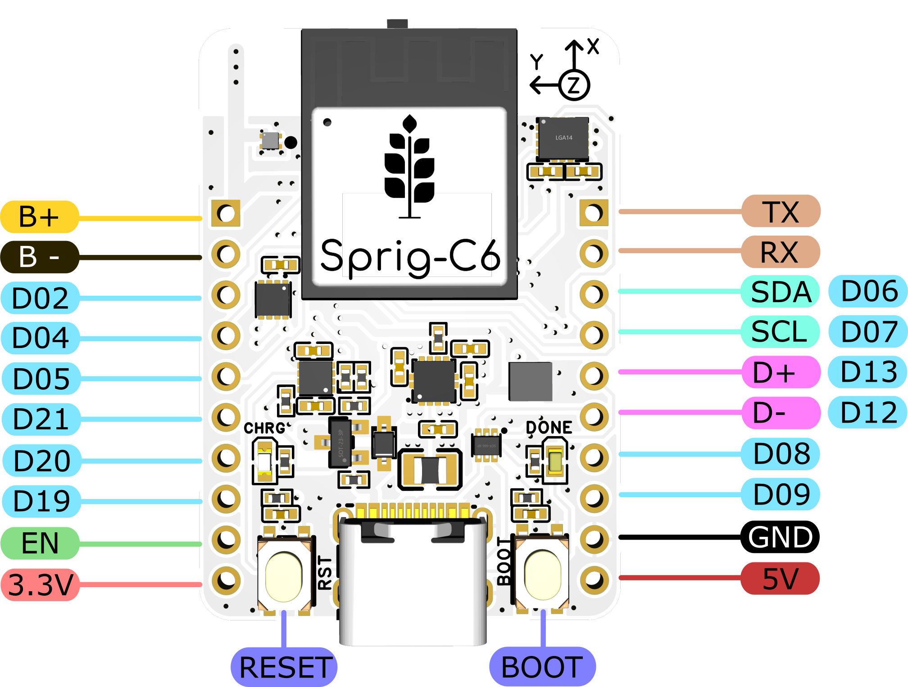
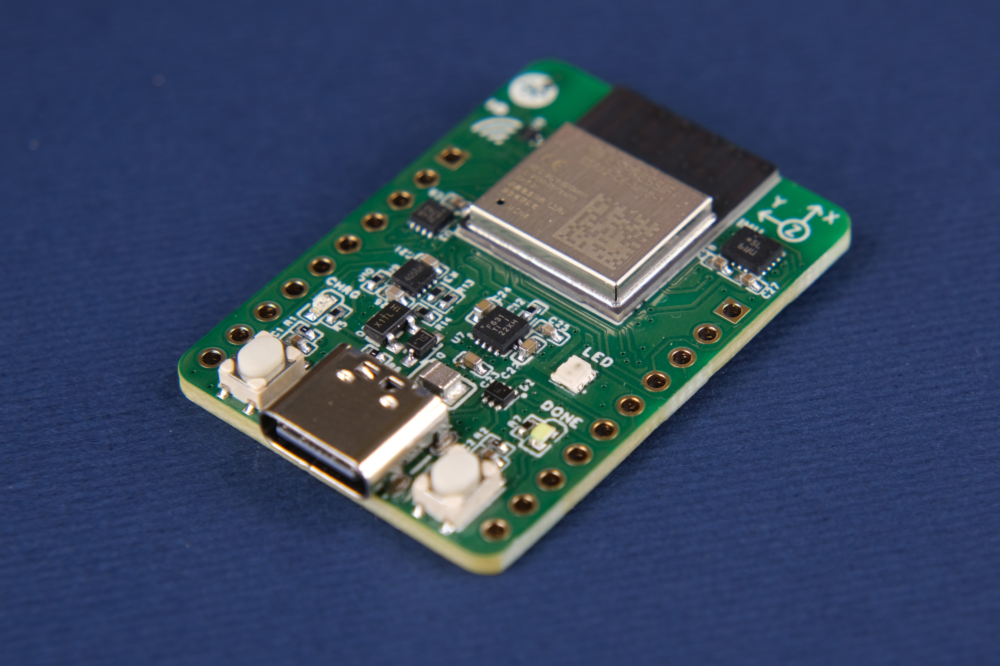

# Sprig-C6 ESP32 Development Board 
**Sprig-C6** is the latest addition to the [SprigStack ecosystem](https://sprig-labs.com/) of boards designed to simplify the development of DIY IoT devices. Sprig-C6 is build around the [ESP32-C6](https://www.espressif.com/en/products/socs/esp32-c6) microcontroller which supports WiFi6, BLE, as well as Zigbee, Matter, and Thread. Creating a Home Assistant device using the Sprig is as simple as it gets: 
1. Plug it to a PC via a USB-C cable while pressing the BOOT button (required only the first time).
2. Flash the firmware using the ESPHome plugin.
3. Copy the provided `.yaml` [configuration](Home%20Assistant%20Setup/c6-config.yaml) onto your ESPHome's `.yaml`

|  |  |
|-------------------------------------------------------------------------------------------------------------------------------------------|-------------------------------------------------------------------------------------------------------------------------------------------|
|  |  |

## Description
### Hardware
#### Main Features
* Li-ion/Li-po battery charging & protection ICs integrated with battery temperature monitoring.
* Accurate battery capacity measurement IC, accessible via I2C on pins 6 and 7.
* Neopixel RGB LED for advanced custom indications.
* BMI260 Accelerometer & Magnetometer.
* USB Type-C port for charging and uploading firmware.
* RESET and BOOT pushbuttons.
* "Charging" and "Done charging" states indicated by 2 LEDs.
* ON-OFF Switch on the battery terminals.
* Breadboard-compatible pin headers breaking out all the pins of ESP32-C6, as well as the USB, battery, and regulated 3.3V.

#### I2C Pins of the Sprig-C3 board
| Function | Pin No |
|----------|--------|
| SDA      | 6      |
| SCL      | 7      |

### Tests
* Battery over-discharge cutoff: 2.8V
* Battery end-of-charge voltage: 4.1V
* Battery thermal cutoff: ~70°C
* Max Charging Current: 500mA
* Regulated 3.3V noise: 10mV
* Maximum total power draw: 105mA
* Average power draw (awake WiFi mode): 32mA

| 3.3V noise @ 5V input & 500mA load: ~10mV                                                                                           | Battery over-discharge event                                                                                          | Battery connection event                                                                                       |
|-------------------------------------------------------------------------------------------------------------------------------------------------|--------------------------------------------------------------------------------------------------------------|---------------------------------------------------------------------------------------------------------------|
|  |  |  |

### Initial Home Assistant setup
#### Requirements:
* Access to Home Assistant Dashboard
* Installed ESPHome plugin

#### Setup process:
1. Connect the Sprig-C6 board on the computer running Home Assistant, while pressing the BOOT button (required only the first time).
2. Open ESPHome, and add a new device as shown [here](https://esphome.io/guides/getting_started_hassio#dashboard-interface).
3. Select "Connect" to upload the initialization firmware on the board, and select the correct port from the popup window. (It usually shows up as a "USB JTAG" device).
4. Wait for the upload to finish, and restart the Sprig-C3. Now, every time you power on the device, it should connect to your WiFi automatically.
5. Last step, is to go to your Home Assistant settings, and Configure your newly discovered device (assuming it is powered on and visible on the network).

#### Video Tutorial: [Fist Home Assistant Setup](https://youtu.be/UaIIV4CaRA4)

### Battery Capacity Measurement
The Sprig-C6 board features the MAX17048 battery capacity measurement IC connected to the respective I2C pins. In the `c6-config.yaml` provided [here](Home%20Assistant%20Setup/c6-config.yaml), there is a sample code for proper communication with the ic. No further setup required.

## Availability
You can get the assembled boards in my [Tindie](https://www.tindie.com/products/34523/), or my [official website](https://sprig-labs.com/) stores.

## Certifications
This project is certified by the [Open Source Hardware Association (OSHWA)](https://certification.oshwa.org/gr000011.html)

<!--  -->

## Support
If you find this project useful, please consider supporting me on any of the following platforms:
* PayPal:

  <a href="https://www.paypal.com/paypalme/kostasparaskevas">
    
* Buy Me a Coffe:

  
* Instagram:
  [@sprig_labs](https://www.instagram.com/sprig_labs/)
* YouTube:
  [@sprig_labs](https://www.youtube.com/@sprig_labs)

